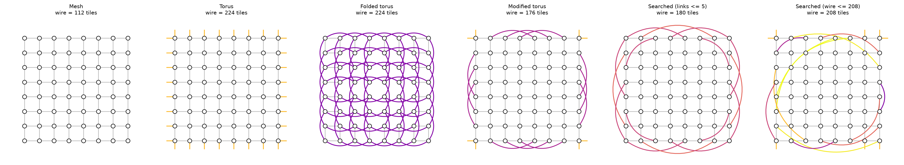
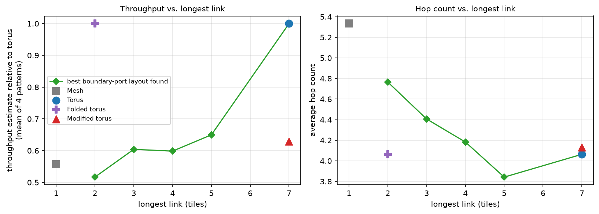
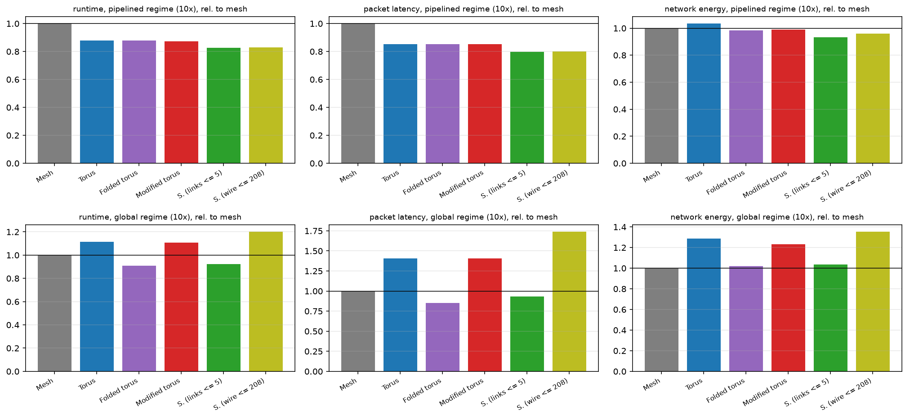
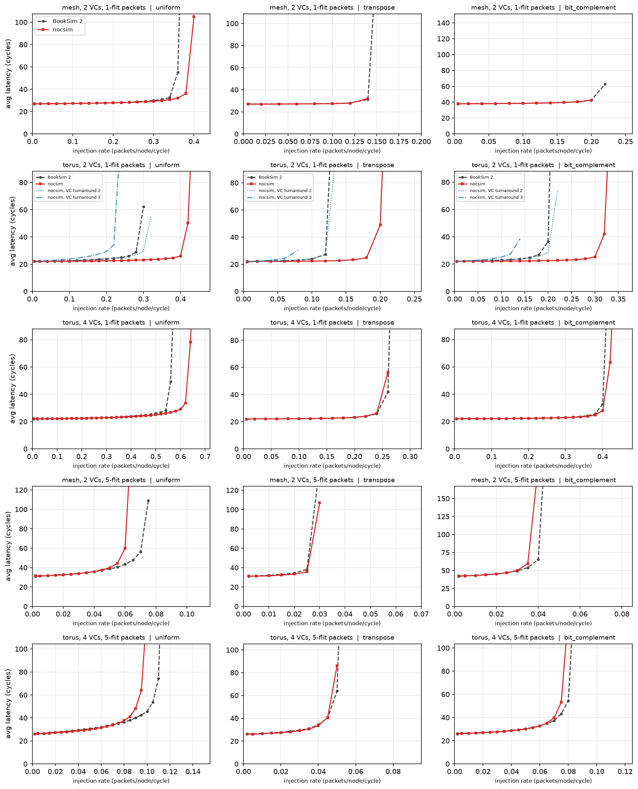
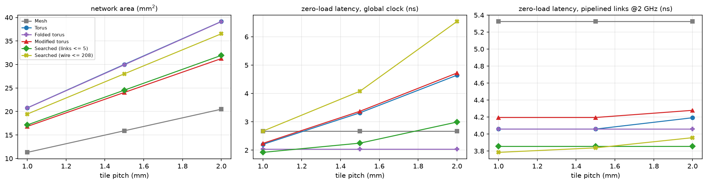

# Where Should the Long Wires Go?

**Total-wire, longest-wire and performance trade-offs in radix-4 on-chip networks: a design-space study with a BookSim-validated simulator, PARSEC traces and DSENT area/energy/timing models**

[](https://doi.org/10.5281/zenodo.23076306)

Rahul Ray · Current manuscript: [`paper/main.pdf`](paper/main.pdf) (prepared for submission to *Journal of Systems Architecture*) · Earlier preprint: [`paper/v1_preprint/main.pdf`](paper/v1_preprint/main.pdf), [doi.org/10.5281/zenodo.23076306](https://doi.org/10.5281/zenodo.23076306)

---

## The question

A 2D mesh leaves 4n router ports unused on the boundary of an n×n grid. A torus spends them on wraparound links; edge-folded designs link boundary routers along the same edge to save wire. Long links cost twice:

* **total wire** sets wire area, repeater area and link energy;
* **the longest wire** sets the clock, because a wire that doesn't fit in one cycle either lowers the clock or must be pipelined (the effect Kite and NetSmith build on for chiplet interposers).

This repository treats the use of those spare ports as a **perfect-matching design space** that contains the mesh, the torus and edge-folded designs, searches it under explicit total-wire and longest-wire constraints, and evaluates the results on an 8×8 network.



## Main results (8×8, 22 nm, 1.5 mm tiles)

| Design | Total wire (tiles) | Longest link | Avg hops | Area (mm²) | Wire-limited clock |
|---|---|---|---|---|---|
| Mesh | 112 | 1 | 5.33 | 15.9 | 4.00 GHz |
| Torus | 224 | 7 | 4.06 | 30.0 | 2.45 GHz |
| Folded torus | 224 | 2 | 4.06 | 29.9 | 4.00 GHz |
| Modified torus | 176 | 7 | 4.13 | 24.1 | 2.45 GHz |
| **Searched (links ≤ 5)** | 180 | 5 | **3.84** | 24.5 | 3.42 GHz |
| Searched (wire ≤ 208) | 208 | 9 | 3.79 | 28.0 | 1.86 GHz |

PARSEC traces (7 benchmarks, geometric mean, relative to mesh; lower is better):

| Design | Runtime, fixed 2 GHz, 10× | EDP, fixed 2 GHz, 10× | Runtime, wire-limited, 10× | EDP, wire-limited, 10× |
|---|---|---|---|---|
| Torus | 0.878 | 0.908 | 1.115 | 1.435 |
| Folded torus | 0.878 | 0.864 | **0.909** | **0.926** |
| Modified torus | 0.872 | 0.863 | 1.108 | 1.366 |
| **Searched (links ≤ 5)** | **0.826** | **0.770** | 0.923 | 0.955 |
| Searched (wire ≤ 208) | 0.829 | 0.796 | 1.202 | 1.628 |

What the data says:

1. **At a fixed clock**, the searched design whose extra links are at most 5 tiles long is the fastest evaluated design: 17% lower runtime and 23% lower energy-delay product than a mesh at 10× compression, and 10% faster than the torus and folded torus at 50×, with 20% less wire than a torus. It is best on 6 of 7 benchmarks; the seventh (vips) is insensitive to the network.
2. **When the longest wire sets the clock**, the folded torus is the best evaluated design. The torus and modified torus, held to 2.45 GHz by 10.5 mm wraparounds, are *slower than the mesh*. The 5-link design comes second, 1.5–3% behind, with 18% less area.
3. **Saving total wire while keeping full-length links** (the modified torus, the design this project started from) buys area but not performance.
4. **At the traces' recorded speed** the network barely matters (all designs within 1.1% of the mesh) and every radix-4 design uses 11–17% *more* network energy than the mesh. The differences above appear when compute gaps are compressed 10–50×, emulating faster cores.
5. **Tile pitch shifts the rankings**: at 1.0 mm tiles the 5-link design is best or tied-best under both clocking regimes; at 2.0 mm only the folded torus beats the mesh under a wire-limited clock.





## Methodology

* **Design space and search.** Perfect matchings of the 4n spare boundary ports (`nocsim/search.py`), with a total-wire budget and/or a longest-link limit. Objective: analytical throughput estimate averaged over uniform, transpose, bit-complement and tornado traffic, minus a hop-count term. Simulated annealing is compared with REINFORCE and random search at equal evaluation budgets (annealing wins; the tabular RL policy has no notion of geometry).
* **Routing and deadlock freedom.** Minimal adaptive routing with an up*/down* escape VC. Flow control is virtual cut-through, so Duato's condition for cut-through networks (IEEE TPDS 1996) applies; the escape channel-dependency graph is checked for cycles for every design. Rerunning all applications with packets confined to the escape VC changes results by at most 0.2%. The thesis-era single-VC BFS routing deadlocks at ≥ 20% load on the torus and modified torus.
* **Cycle-level simulator** (`nocsim/simulator.py`): input-queued routers, 3 VCs, credit-based virtual cut-through, multi-flit packets, a 2-cycle VC turnaround that reproduces BookSim's router pipeline, and activity counters for energy.
* **Validation against BookSim 2** (`experiments/05_booksim_validation.py`): dimension-order routing on mesh and torus, 1- and 5-flit packets. Zero-load latency within 2.1%, mean latency error 0.2–5.3% and saturation within 0.06 packets/node/cycle wherever each traffic class has ≥ 2 VCs; the one-VC-per-class gap is explained and closed by the VC turnaround.

  

* **Application traces** (`nocsim/traces.py`): Netrace PARSEC traces (blackscholes, canneal, ferret, fluidanimate, swaptions, vips, x264), captured on a 64-core 8×8 CMP; 250k packets of each region of interest replayed with their dependencies, so completion time is a runtime proxy. Compute gaps are converted to real time with the original 2 GHz core clock so networks at different clocks compare fairly.
* **Area, energy and timing** (`nocsim/power.py`, `tools/dsent_main/`): DSENT at 22 nm for 3-, 4- and 5-port routers (each router modelled with its real port count) and repeated global wires. One-cycle wire reach: 13.0 mm at 2 GHz, 8.5 mm at 3 GHz, 6.5 mm at 4 GHz. Two regimes: a **fixed 2 GHz clock** (long links pipelined), and a **wire-limited clock** where each network runs as fast as its longest link allows.
* **Folded torus fairness.** The folded torus is modelled as the torus graph with the same core mapping and only its physical link lengths changed, so it receives exactly the torus's traffic.



## Repository layout

```
nocsim/              library: topology, metrics, routing, traffic, simulator, traces, power, search
experiments/         01-09, one script per experiment, plus shared helpers (common.py)
  booksim/           BookSim driver (stdlib only; runs on Linux/WSL)
  booksim_base.cfg   BookSim configuration matched to nocsim
tools/
  netrace_dump/      converts Netrace .tra.bz2 traces to text for nocsim
  dsent_main/        standalone DSENT driver and characterisation script
tests/               pytest suite (61 tests)
results/             raw results (CSV/JSON), figures, searched designs, DSENT data
paper/               current manuscript (LaTeX + PDF); literature/ notes and verified references
paper/v1_preprint/   the earlier 7-page preprint that matches the Zenodo DOI
```

| Experiment | What it does | Time* |
|---|---|---|
| `01_static_metrics.py` | hops, wire, throughput estimates vs. grid size | 10 s |
| `02_deadlock.py` | channel-dependency-graph check + BFS deadlock in simulation | 1 min |
| `03_topology_search.py` | search methods and total-wire frontier | 25 min |
| `04_simulation.py` | synthetic load–latency curves, six designs, 2 and 4 GHz | 3 min |
| `05_booksim_validation.py` | comparison with BookSim (needs `booksim_raw.json`) | 3 min |
| `06_link_length_search.py` | best designs per longest-link limit | 11 min |
| `07_area_timing.py` | DSENT area, clock and zero-load latency vs. tile pitch | 1 min |
| `08_applications.py` | PARSEC traces, two clocking regimes, energy | 4 min |
| `09_per_benchmark.py` | per-benchmark table for the paper | 1 s |

\*on a 40-thread machine; experiments run in parallel processes.

## Reproducing

Python ≥ 3.10:

```bash
git clone https://github.com/R4hulR/nocsim.git
cd nocsim
pip install -r requirements.txt
python -m pytest                                   # 61 tests
python experiments/01_static_metrics.py            # ... and so on, in order 01-07
```

External tools (Linux or WSL; none are stored in this repository):

```bash
# BookSim 2 (needs flex and bison)
git clone https://github.com/booksim/booksim2.git && make -C booksim2/src
python3 experiments/booksim/run_booksim.py --booksim booksim2/src/booksim
python experiments/05_booksim_validation.py

# DSENT, from gem5's ext/dsent, built standalone
git clone --depth 1 --filter=blob:none --sparse https://github.com/gem5/gem5.git
(cd gem5 && git sparse-checkout set ext/dsent)
(cd gem5/ext/dsent && g++ -O2 -std=c++14 -w -I. $(find . -name '*.cc' ! -name interface.cc) \
    ../../../tools/dsent_main/dsent_main.cc -o ../../../dsent)
(cd gem5 && python3 ../tools/dsent_main/characterize.py --dsent ../dsent --techs 22 \
    --out ../results/dsent_characterization.json)

# Netrace PARSEC traces (https://www.cs.utexas.edu/~netrace/), e.g. blackscholes
curl -O https://www.cs.utexas.edu/~netrace/download/netrace-1.0.tar.bz2 && tar xjf netrace-1.0.tar.bz2
curl -O https://www.cs.utexas.edu/~netrace/download/blackscholes_64c_simsmall.tra.bz2
gcc -O2 -w -Inetrace-1.0 tools/netrace_dump/netrace_dump.c netrace-1.0/netrace.c netrace-1.0/queue.c -o netrace_dump
mkdir -p traces && ./netrace_dump blackscholes_64c_simsmall.tra.bz2 2 250000 > traces/blackscholes_64c_simsmall.txt
python experiments/08_applications.py --traces traces
python experiments/09_per_benchmark.py
```

All runs are seeded. `results/dsent_characterization.json` is included, so experiments 4, 7 and 8 run without building DSENT.

Quick start from Python:

```python
from nocsim import torus
from nocsim.topology import folded_torus
from nocsim.power import TechModel
from nocsim.simulator import simulate, SimConfig

tm = TechModel.from_dsent(tile_mm=1.5)
print(tm.max_frequency(torus(8)) / 1e9, tm.max_frequency(folded_torus(8)) / 1e9)  # 2.45 vs 4.0 GHz
r = simulate(torus(8), "transpose", rate=0.3, cfg=SimConfig(vc_turnaround=2))
print(r.avg_latency, r.accepted, r.saturated)
```

## Limitations

* Netrace traces come from 2010-era in-order cores and are light; differences appear only with compressed compute gaps. Full-system simulation (gem5/Garnet) would be stronger.
* Area, energy and timing come from DSENT models, not place-and-route; wire length is Manhattan distance on the floorplan.
* Virtual cut-through rather than wormhole flow control; BookSim validation covers dimension-order routing only (BookSim cannot run the escape scheme).
* One grid size (8×8), radix 4, boundary-port designs only. No NetSmith-generated baseline: NetSmith targets concentrated interposer networks and relies on a commercial MILP solver.

## History

The edge-folded "modified torus" started as a B.Tech. thesis at Assam University (S. Sharma, R. Ray, B. R. S. Satyanarayana; supervisor Dr. A. Biswas; 2023), evaluated then by hop counts on a 5×5 grid. A first re-evaluation (generalisation to n×n, a cycle-level simulator, deadlock analysis, topology search) is the [v1 preprint](paper/v1_preprint/main.pdf). The current manuscript broadens it into a design-space study with application traces, DSENT models, a fair folded-torus baseline and BookSim validation. The original thesis files are not included in this repository.

## Citation

```bibtex
@misc{ray2026lesswire,
  author    = {Ray, Rahul},
  title     = {Less Wire, Less Throughput: Re-evaluating a Boundary-Folded Torus Network-on-Chip},
  year      = {2026},
  publisher = {Zenodo},
  doi       = {10.5281/zenodo.23076306},
  url       = {https://doi.org/10.5281/zenodo.23076306}
}
```

The current manuscript, *"Where Should the Long Wires Go? Total-Wire, Longest-Wire and Performance Trade-offs in Radix-4 On-Chip Networks,"* is not yet published; cite the preprint above or this repository.

## License

MIT (see [LICENSE](LICENSE)).
