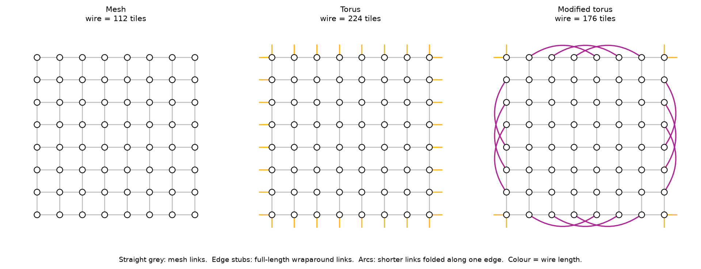
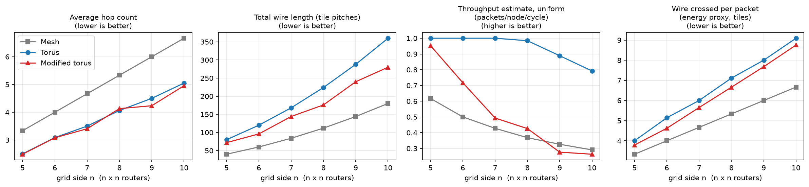
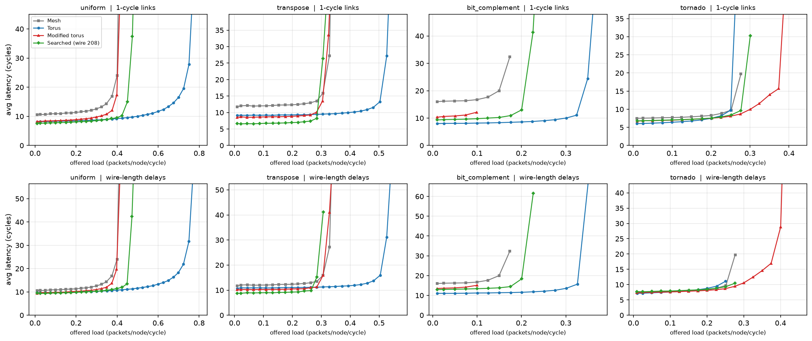
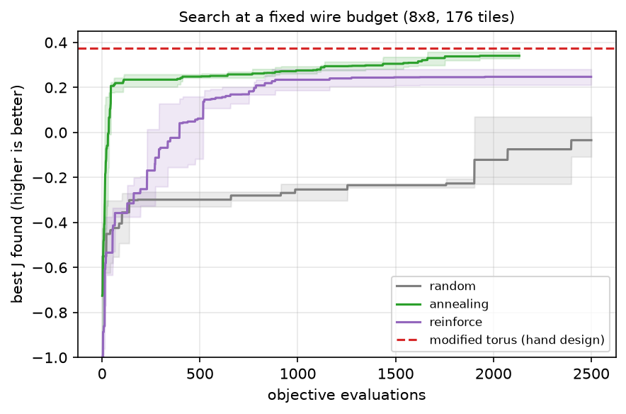
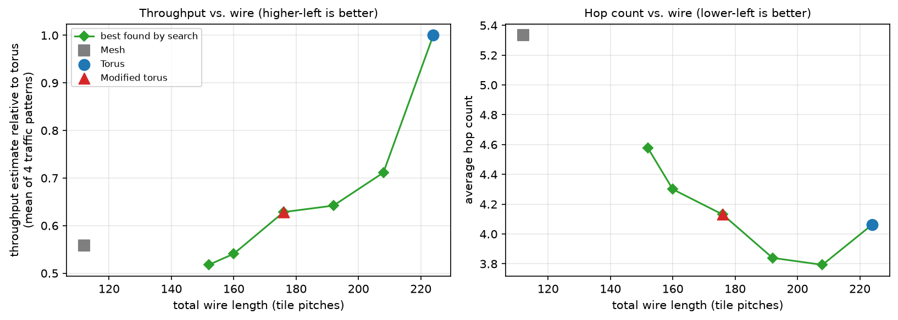
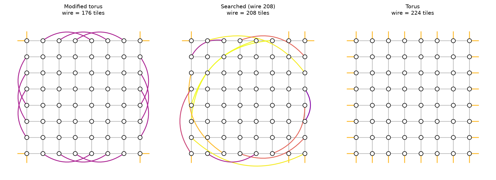

# Revisiting the Modified Torus Network-on-Chip

**Wire length, throughput and deadlock in a hand-designed NoC topology, evaluated with a cycle-level simulator and automated topology search**

This repository revisits a Network-on-Chip (NoC) topology proposed in a 2023 B.Tech thesis and evaluates it rigorously. The original work proposed a "modified torus" and claimed it beats mesh and torus on hop count, latency and throughput, but it measured only BFS hop counts on a single 5×5 grid. This version:

1. **generalises** the topology from a hand-written 5×5 adjacency list to a rule for any *n×n* grid;
2. **adds the missing metrics**: physical wire length and channel-load throughput;
3. **shows that the original BFS routing can deadlock**, proves it with channel-dependency graphs, observes it in simulation, and replaces it with a provably deadlock-free adaptive scheme;
4. **builds a cycle-level router simulator** to measure latency vs. load under standard synthetic traffic patterns;
5. **turns topology design into an optimisation problem** and compares random search, simulated annealing and policy-gradient RL (REINFORCE) at finding better link layouts.

The short answer: the modified torus is a real trade-off, not a free win. At 8×8 it saves **21% of the wire** of a torus (up to 22% at 10×10), at the cost of **≈45% lower saturation throughput** under uniform traffic. Within its wire budget, though, it is as good as anything the search found.



---

## Background

The modified torus was proposed in the B.Tech thesis *"Study on BFS base routing of a New Modified Torus NoC Topology"* (S. Sharma, R. Ray, B. R. S. Satyanarayana; supervisor Dr. A. Biswas; Assam University, 2023). The original code and thesis are not included in this repository; they are available on request. Its 5×5 adjacency list is reproduced in `tests/test_topology.py`, and the generalised construction is checked against it. Everything under `nocsim/`, `experiments/` and `tests/` is a later, independent re-implementation and extension.

**The idea.** A 2D mesh leaves 4*n* router ports unused on its boundary (corners have 2 spare ports, other edge routers have 1). A torus spends them on *n*-tile-long wraparound links to the opposite edge. The modified torus keeps the wraparounds only at the corners (and the middle row/column for odd *n*). Every other boundary router is linked to a router (*n*−1)/2 positions away *along the same edge*. These links are shorter, so the network uses less wire, and every router keeps radix 4.

### What changed relative to the 2023 code

| | 2023 thesis code | This repository |
|---|---|---|
| Topology | 100 hand-written `add_neighbor` lines, 5×5 only | Rule for any *n* ≥ 5, verified to reproduce the 5×5 list exactly |
| "Latency" | BFS hop count; `time.sleep(0.1)` per hop | Cycle-level simulation: buffers, virtual channels, credits, contention |
| "Throughput" | `1 / hop_count` | Saturation throughput (simulated) and channel-load estimate (analytical) |
| Wire length | not considered | Measured per link on the floorplan |
| Deadlock | not considered (shortest-path routing on a torus) | CDG analysis + Duato-style adaptive routing with up*/down* escape |
| `use_virtual_channel=True` | Only allowed neighbours with ≤ 2 links, but every node has 4, so routing always returned `None` | Real virtual channels |
| Topology design | by hand | Searched automatically (annealing, REINFORCE, random) |
| Tests | none | 38 `pytest` tests, including closed-form checks against textbook results |

---

## Key results

All numbers are for an 8×8 network unless stated otherwise. Each row of the tables can be regenerated with the scripts in `experiments/`.

### 1. The modified torus trades throughput for wire

| 8×8 | Links | Diameter | Avg. hops | Total wire (tiles) | Throughput estimate, uniform |
|---|---|---|---|---|---|
| Mesh | 112 | 14 | 5.33 | 112 | 0.37 |
| Torus | 128 | 8 | 4.06 | 224 | 0.98 |
| Modified torus | 128 | 8 | 4.13 | **176 (−21%)** | **0.43 (−57%)** |



* **Hop count is essentially unchanged.** The modified torus is slightly better at most sizes (up to −5.9% at 9×9) and slightly worse at 8×8. The thesis's hop-count improvement is real but small.
* **Wire savings grow with size**, from 10% at 5×5 to 22% at 10×10.
* **Throughput falls sharply.** The torus spreads uniform traffic evenly over its links. The modified torus funnels it through its folded edge links, and by 9×9 its throughput estimate drops *below the plain mesh*. The thesis didn't have a channel-load metric, so it couldn't see this.

### 2. The original BFS routing deadlocks; adaptive routing with an escape channel does not

Deterministic shortest-path routing on any topology with cycles can deadlock. The channel dependency graph (Dally & Seitz) confirms it is **cyclic** for both the torus and the modified torus. In simulation (8×8, uniform traffic, 5 seeds each), BFS routing with one virtual channel froze in **every run at ≥ 20% load**:

| Fraction of runs deadlocked | 0.05 | 0.10 | 0.15 | 0.20 | 0.30 | 0.50 |
|---|---|---|---|---|---|---|
| Torus, BFS (thesis) | 0 | 0 | 0 | **1.0** | **1.0** | **1.0** |
| Modified torus, BFS (thesis) | 0 | 0 | 0 | **1.0** | **1.0** | **1.0** |
| Either, adaptive + up*/down* escape | 0 | 0 | 0 | 0 | 0 | 0 (also 0 at 0.6 and 1.0) |

The fix is minimal adaptive routing on virtual channels 1..V−1, plus an escape channel (VC 0) that uses up*/down* routing (Duato, 1993; Schroeder et al., 1991). Up*/down* is deadlock-free on *any* connected graph, which matters because the topology search produces irregular networks. Its channel dependency graph is checked to be acyclic in the tests.

### 3. Cycle-level simulation confirms the trade-off, and finds a niche

Simulator setup: 3 VCs, 4-packet buffers, 1-cycle router + link, open-loop Bernoulli injection, 1000-cycle warm-up, and 3000 measured cycles drained to completion. Saturation is the highest load that still delivers ≥ 95% of the offered traffic with latency < 3× zero-load.

| Saturation throughput (pkts/node/cycle) | uniform | transpose | bit-complement | tornado | zero-load latency, uniform |
|---|---|---|---|---|---|
| Mesh | 0.40 | 0.33 | 0.17 | 0.28 | 10.6 cycles |
| Torus | **0.72** | **0.52** | **0.32** | 0.25 | 8.1 |
| Modified torus | 0.40 | 0.30 | 0.10 | **0.37** | 8.3 |
| Searched, 208 tiles (see §4) | 0.45 | 0.28 | 0.20 | 0.28 | **7.5** |



* The modified torus has **torus-like latency at low load** (8.3 vs. 10.6 cycles for the mesh) but **mesh-like saturation throughput**.
* When long wires are charged their real delay (bottom row: a link of length *L* takes ⌈*L*/2⌉ cycles), the modified torus has slightly *lower* zero-load latency than the torus (9.4 vs. 9.6 cycles on uniform traffic, 10.2 vs. 10.7 on transpose).
* **Tornado traffic is the modified torus's niche**: 0.37 vs. 0.25 for the torus (+50%). **Bit-complement is its worst case**: 0.10, below even the mesh, because all traffic must cross the centre and the folded links don't help with that.
* The simulator's throughput is typically 70–95% of the analytical estimate, and adaptive routing sometimes *beats* it (mesh, tornado), because the estimate assumes traffic is split evenly over shortest paths. It is a fast proxy, not a bound, which is why every search result is re-checked in simulation.

### 4. Automated topology search: the hand design is on the frontier

The 4*n* spare boundary ports can be paired in a huge number of ways. The torus and the modified torus are just two of them. The search maximises

> J = mean over {uniform, transpose, bit-complement, tornado} of (throughput estimate ÷ torus's) − 0.25 × (avg. hops ÷ torus's), subject to total wire ≤ budget.

**Method comparison**, at the modified torus's own budget (176 tiles), 2500 evaluations, 3 seeds:

| Method | Best J (mean ± std) |
|---|---|
| Random search | −0.03 ± 0.08 |
| REINFORCE (autoregressive matching policy) | 0.25 ± 0.03 |
| Simulated annealing (cold start) | 0.34 ± 0.02 |
| **Modified torus (hand design)** | **0.37**. Annealing *starting from* it found nothing better. |



**Wire/throughput frontier** (best design found for each wire budget):



* **The modified torus sits on the empirical frontier.** At 176 tiles, no searched design beat it.
* **An earlier, uniform-traffic-only version of the objective was misleading.** It "found" a design with a 13% higher uniform estimate at the same wire. In simulation, that design was 80% better than the modified torus on bit-complement but 16% worse on transpose. Averaging the objective over several traffic patterns fixed this. It is a small, concrete case of optimising a proxy objective and overfitting it.
* **The frontier is steep near the torus.** Going from 208 to 224 tiles (+8% wire) raises the throughput estimate from 0.71 to 1.0 of the torus's. The searched 208-tile design (shown below) has the **lowest zero-load latency of all four networks** (7.5 cycles uniform, 6.7 transpose) and 2× the modified torus's bit-complement throughput.
* **RL underperforms annealing here.** A tabular policy has no notion of *geometry*: it can't tell that pairing port 3 with port 7 is similar to pairing port 4 with port 8. A policy that shares structure across ports, such as a graph neural network over the floorplan, is the natural next step.



---

## How it works

| Module | What it does |
|---|---|
| `nocsim/topology.py` | Mesh, torus and modified torus builders, plus any "mesh + boundary links" design. Wire length on the floorplan. |
| `nocsim/metrics.py` | All-pairs BFS with shortest-path counts; channel load with flows split evenly over minimal paths (vectorised with NumPy); throughput estimate including ejection limits. |
| `nocsim/routing.py` | BFS (thesis), up*/down*, and minimal-adaptive with escape routing tables; channel-dependency-graph deadlock check. |
| `nocsim/traffic.py` | Uniform, transpose, bit-complement, tornado and hotspot patterns, as samplers (for simulation) and as matrices (for analysis). |
| `nocsim/simulator.py` | Cycle-level input-queued router model: virtual channels, credit flow control, separable allocation, pipelined links, open-loop measurement, saturation and deadlock detection. |
| `nocsim/search.py` | Design space of boundary-port matchings; random search, simulated annealing, REINFORCE. |

**Modelling simplifications** (they apply equally to every topology): single-flit packets with virtual cut-through, not multi-flit wormhole; greedy separable allocation, not iSLIP; credits return at the end of the cycle; wire length is the Manhattan distance on the floorplan, with no folded-torus layout and no power model beyond "wire tiles crossed per packet". The results are for comparing topologies against each other, not for predicting absolute performance of a specific chip.

---

## Reproducing

Requires Python ≥ 3.10.

```bash
pip install -r requirements.txt
python -m pytest                              # 38 tests, ~20 s

python experiments/01_static_metrics.py       # ~10 s
python experiments/02_deadlock.py             # ~1 min
python experiments/03_topology_search.py      # ~25 min on 24 cores (parallel)
python experiments/04_simulation.py           # ~10 min on 24 cores; uses a design saved by 03
```

Outputs go to `results/` (CSV/JSON) and `results/figures/` (PNG). All runs are seeded.

Quick start from Python:

```python
from nocsim import modified_torus, torus
from nocsim.metrics import summary
from nocsim.simulator import simulate, SimConfig

print(summary(modified_torus(8)))                       # hops, wire, throughput estimate, ...
r = simulate(torus(8), "transpose", rate=0.3, cfg=SimConfig())
print(r.avg_latency, r.accepted, r.saturated)
```

## Repository layout

```
nocsim/              the library (topology, metrics, routing, traffic, simulator, search)
experiments/         one script per experiment (01-04) + shared plotting/sweep helpers
tests/               pytest suite
results/             generated tables, figures and searched designs
paper/               LaTeX source and PDF of the write-up
```

## Limitations and future work

* **Synthetic traffic only.** Application traces (e.g. PARSEC through gem5/Garnet) would show whether tornado-like or bit-complement-like patterns dominate in practice, and that decides whether the modified torus is worth using.
* **No physical layout.** A *folded* torus equalises link lengths and changes the wire comparison. Area and power models (e.g. DSENT/Orion) would turn "wire tiles" into joules and mm².
* **Search with structure.** Replace the tabular REINFORCE policy with a GNN policy, and put the simulator (or a learned surrogate of it) in the loop instead of the analytical estimate.
* **Learned routing.** Topology and routing were optimised separately. Q-routing-style adaptive routing (Boyan & Littman, 1994) could be co-designed with the topology.

## References

* W. J. Dally, B. Towles. *Principles and Practices of Interconnection Networks.* Morgan Kaufmann, 2004.
* W. J. Dally, C. L. Seitz. "Deadlock-free message routing in multiprocessor interconnection networks." *IEEE Trans. Computers*, 1987.
* J. Duato. "A new theory of deadlock-free adaptive routing in wormhole networks." *IEEE TPDS*, 1993.
* M. D. Schroeder et al. "Autonet: a high-speed, self-configuring local area network using point-to-point links." *IEEE JSAC*, 1991.
* R. J. Williams. "Simple statistical gradient-following algorithms for connectionist reinforcement learning." *Machine Learning*, 1992.
* J. A. Boyan, M. L. Littman. "Packet routing in dynamically changing networks: a reinforcement learning approach." *NeurIPS*, 1994.
* S. Kumar et al. "A network on chip architecture and design methodology." *ISVLSI*, 2002.
